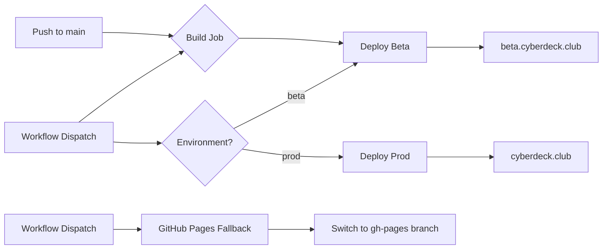

# Deployment Guide

## Overview

cyberdeck.club uses a GitHub Actions workflow for CI/CD deployment to Cloudflare Pages.

## Environments

| Environment | URL | Trigger | Branch |
|-------------|-----|---------|--------|
| **Beta** | https://beta.cyberdeck.club | Push to `main` | `main` |
| **Production** | https://cyberdeck.club | Manual workflow dispatch | `main` |

## Deployment Architecture



## GitHub Secrets Configuration

Before deploying, configure these secrets in your GitHub repository:

| Secret | Description | Where to Find |
|--------|-------------|---------------|
| `CLOUDFLARE_API_TOKEN` | API token for Cloudflare Workers/Pages | Cloudflare Dashboard → Profile → API Tokens |
| `CLOUDFLARE_ACCOUNT_ID` | Your Cloudflare account ID | Cloudflare Dashboard → Overview |

### Creating the Cloudflare API Token

1. Go to [Cloudflare Dashboard](https://dash.cloudflare.com)
2. Navigate to **My Profile** → **API Tokens**
3. Click **Create Token** → **Edit Cloudflare Workers** template
4. Set account resources to "Include" your account
5. Copy the generated token and add it to GitHub Secrets

## Deployment Methods

### 1. Beta (Auto-deploy)

Beta deployments happen automatically when you push to `main`:

```bash
git checkout main
git merge feature/your-feature
git push origin main
```

The workflow will:
1. Build the project
2. Deploy to Cloudflare Pages with `branch=beta`
3. Make the beta version live at https://beta.cyberdeck.club

### 2. Production (Manual)

To deploy to production:

1. Go to the **Actions** tab in GitHub
2. Select the **Deploy** workflow
3. Click **Run workflow**
4. Select `prod` from the environment dropdown
5. Click **Run workflow**

Or use GitHub CLI:

```bash
gh workflow run deploy.yml --field environment=prod
```

### 3. GitHub Pages Fallback (Manual)

If Cloudflare Pages is unavailable, you can switch to serve from GitHub Pages:

1. Go to the **Actions** tab in GitHub
2. Select the **Deploy** workflow
3. Click **Run workflow**
4. Leave environment as `beta` (or select any)
5. Enter your GitHub Pages branch name (e.g., `gh-pages`) in the `github_pages_branch` field
6. Click **Run workflow**

This will:
1. Check out the specified branch
2. Deploy its contents to Cloudflare Pages
3. Cloudflare will serve the fallback content while Cloudflare Pages infrastructure is restored

## Workflow Details

### Build Step

The workflow always builds first:

```yaml
npm ci
npm run lint  # type check, continues on error
npm run build  # runs: astro build
```

### Artifact Sharing

Build artifacts are uploaded and downloaded between jobs to avoid redundant builds.

### Concurrency

The workflow uses concurrency groups to:
- Cancel in-progress runs when a new push occurs
- Prevent overlapping deployments

## Required Repository Variables

Set these in **Settings** → **Variables** → **Actions**:

| Variable | Value | Description |
|----------|-------|-------------|
| `PUBLIC_BASE_URL` | `https://cyberdeck.club` | Production base URL |

## D1 Database Migrations

Database migrations are **not** automated in this workflow. To apply migrations to production:

```bash
# Apply migrations to production D1
npm run db:migrate:prod
```

Or use wrangler directly:

```bash
wrangler d1 migrations apply cyberdeck-club --remote
```

## Troubleshooting

### Deployment fails with permission error

Ensure `CLOUDFLARE_API_TOKEN` has permissions for:
- `Cloudflare Pages: Edit`
- `Account Settings: Read`

### Build succeeds but site shows old content

- Check Cloudflare Cache (purge cache in Cloudflare Dashboard)
- Verify the correct branch is deployed in Pages dashboard

### Workflow doesn't trigger

- Ensure Actions are enabled in **Settings** → **Actions**
- Check that the workflow file is at `.github/workflows/deploy.yml`