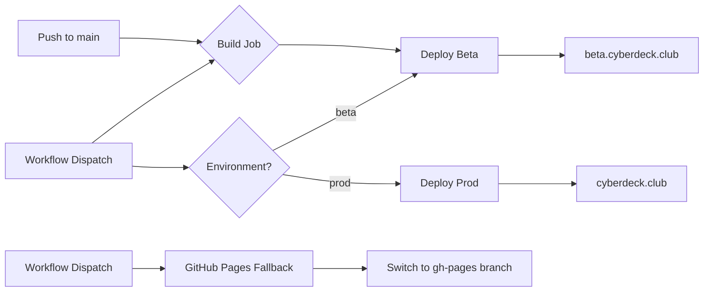

# Deployment Guide

## Overview

cyberdeck.club uses a GitHub Actions workflow for CI/CD deployment to **Cloudflare Pages**. The project uses Astro with the Cloudflare adapter, deploying via `wrangler pages deploy`.

## Environments

| Environment | URL | Trigger | Pages Branch | CF Pages Environment |
|-------------|-----|---------|-------------|----------------------|
| **Beta** | https://beta.cyberdeck.club | Push to `main` | `beta` | Preview |
| **Production** | https://cyberdeck.club | Manual workflow dispatch | `production` | Production |

### How Cloudflare Pages Environments Work

Cloudflare Pages has **two built-in environments**: **Production** and **Preview**. These are managed in the Cloudflare dashboard — not via `wrangler.jsonc` `env` blocks (those are a Workers-only concept).

- **Production** — Serves the production domain (`cyberdeck.club`). Deployed with `--branch=production`.
- **Preview** — Serves preview/beta domains (`beta.cyberdeck.club`). Any non-production branch deploy goes here.

The `env.beta` and `env.prod` blocks in `wrangler.jsonc` exist **only** for D1 CLI commands (migrations, queries) — they are ignored by `wrangler pages deploy`.

## Deployment Architecture



## Prerequisites

### 1. GitHub Secrets

Configure these secrets in your GitHub repository (**Settings** → **Secrets and variables** → **Actions**):

| Secret | Description | Where to Find |
|--------|-------------|---------------|
| `CLOUDFLARE_API_TOKEN` | API token for Cloudflare Workers/Pages | Cloudflare Dashboard → Profile → API Tokens |
| `CLOUDFLARE_ACCOUNT_ID` | Your Cloudflare account ID | Cloudflare Dashboard → Overview (right sidebar) |

#### Creating the Cloudflare API Token

1. Go to [Cloudflare Dashboard](https://dash.cloudflare.com)
2. Navigate to **My Profile** → **API Tokens**
3. Click **Create Token** → Use the **Edit Cloudflare Workers** template
4. Ensure these permissions are included:
   - `Cloudflare Pages: Edit`
   - `D1: Edit` (for automated migrations)
   - `Account Settings: Read`
5. Set account resources to "Include" your account
6. Copy the generated token and add it to GitHub Secrets

### 2. GitHub Repository Variables

Set these in **Settings** → **Variables** → **Actions**:

| Variable | Value | Description |
|----------|-------|-------------|
| `PUBLIC_BASE_URL` | `https://cyberdeck.club` | Used at build time for Astro |

### 3. Cloudflare Pages Dashboard — Bindings & Secrets

This is the critical step that can't be done from code. Environment-specific bindings and secrets must be configured in the Cloudflare dashboard.

**Navigation:** Workers & Pages → `cyberdeck-club` → **Settings** → **Bindings**

> ⚠️ **Look for the environment dropdown** at the top of the bindings page. It lets you switch between **Production** and **Preview**. This dropdown can scroll out of view — scroll up if you don't see it.

Configure these for **each environment separately**:

#### D1 Database Binding

| Environment | Binding Name | Database |
|-------------|-------------|----------|
| **Production** | `DB` | `cyberdeck-db` |
| **Preview** | `DB` | `cyberdeck-db-beta` |

#### Environment Variables & Secrets

| Name | Type | Production | Preview |
|------|------|-----------|---------|
| `BETTER_AUTH_SECRET` | Secret (encrypted) | *your-prod-secret* | *your-beta-secret* |
| `RESEND_API_KEY` | Secret (encrypted) | *your-key* | *your-key* |
| `RESEND_FROM_ADDRESS` | Variable | `CyberDeck <noreply@cyberdeck.club>` | `CyberDeck <noreply@cyberdeck.club>` |
| `EMAIL_FROM` | Variable | `CyberDeck <noreply@cyberdeck.club>` | `CyberDeck <noreply@cyberdeck.club>` |
| `ADMIN_EMAIL` | Variable | *your-admin-email* | *your-admin-email* |
| `PUBLIC_BASE_URL` | Variable | `https://cyberdeck.club` | `https://beta.cyberdeck.club` |

## Deployment Methods

### 1. Beta (Auto-deploy)

Beta deployments happen automatically when you push to `main`:

```bash
git checkout main
git merge feature/your-feature
git push origin main
```

The workflow will:
1. Build the project
2. Checkout `wrangler.jsonc` and `drizzle/migrations/` (sparse checkout)
3. Run D1 migrations against `cyberdeck-db-beta` via `--env beta`
4. Deploy to Cloudflare Pages with `--branch=beta` → Preview environment
5. Make the beta version live at https://beta.cyberdeck.club

### 2. Production (Manual)

To deploy to production:

1. Go to the **Actions** tab in GitHub
2. Select the **Deploy** workflow
3. Click **Run workflow**
4. Select `prod` from the environment dropdown
5. Click **Run workflow**

Or use GitHub CLI:

```bash
gh workflow run deploy.yml --field environment=prod
```

The workflow will:
1. Build the project
2. Run D1 migrations against `cyberdeck-db` via `--env prod`
3. Deploy to Cloudflare Pages with `--branch=production` → Production environment
4. Make the production version live at https://cyberdeck.club

### 3. GitHub Pages Fallback (Manual)

If Cloudflare Pages is unavailable, you can switch to serve a static fallback:

1. Go to the **Actions** tab in GitHub
2. Select the **Deploy** workflow
3. Click **Run workflow**
4. Leave environment as `beta` (or select any)
5. Enter your GitHub Pages branch name (e.g., `gh-pages`) in the `github_pages_branch` field
6. Click **Run workflow**

This will:
1. Check out the specified branch
2. Deploy its contents to Cloudflare Pages
3. Cloudflare will serve the fallback content

## D1 Database Migrations

Migrations run **automatically** as part of the GitHub Actions deploy workflow. They execute before each deploy step.

### Manual Migration Commands

If you need to run migrations manually:

```bash
# Local development
npm run db:migrate

# Beta (remote)
npm run db:migrate:beta

# Production (remote)
npm run db:migrate:prod
```

Or use wrangler directly:

```bash
# Beta
wrangler d1 migrations apply cyberdeck-db-beta --env beta --remote

# Production
wrangler d1 migrations apply cyberdeck-db --env prod --remote
```

### How `wrangler.jsonc` env blocks work with D1

The `env.beta` and `env.prod` blocks in `wrangler.jsonc` resolve the correct database ID when you pass `--env beta` or `--env prod` to wrangler CLI commands. They are **not** used by `wrangler pages deploy` — deployed Pages get their D1 binding from the Cloudflare dashboard configuration.

## Workflow Details

### Build Step

The workflow always builds first:

```yaml
npm ci
npm run lint  # type check (astro check), continues on error
npm run build  # runs: astro build
```

### Artifact Sharing

Build artifacts (`dist/`) are uploaded and downloaded between jobs to avoid redundant builds. Deploy jobs also do a sparse checkout of `wrangler.jsonc` and `drizzle/migrations/` for D1 migration support.

### Concurrency

The workflow uses concurrency groups to:
- Cancel in-progress runs when a new push occurs
- Prevent overlapping deployments

## Troubleshooting

### Can't find environment settings in Cloudflare dashboard

Go to **Workers & Pages** (combined section in sidebar) → click `cyberdeck-club` → **Settings** → **Bindings**. Look for the **Production / Preview dropdown** at the top of the page — it may scroll out of view.

### Deployment fails with permission error

Ensure `CLOUDFLARE_API_TOKEN` has permissions for:
- `Cloudflare Pages: Edit`
- `D1: Edit`
- `Account Settings: Read`

### D1 migrations fail in CI

The deploy jobs do a sparse checkout of the repo to get `wrangler.jsonc` and `drizzle/migrations/`. If migrations fail:
- Check that the migration files exist in `drizzle/migrations/`
- Verify the database IDs in `wrangler.jsonc` match your actual D1 databases
- Ensure `CLOUDFLARE_API_TOKEN` has D1 edit permissions

### Build succeeds but site shows old content

- Check Cloudflare Cache (purge cache in Cloudflare Dashboard)
- Verify the correct branch is deployed in Pages dashboard

### Secrets not available at runtime

Remember: secrets like `BETTER_AUTH_SECRET` and `RESEND_API_KEY` must be set in the **Cloudflare Pages dashboard** (not in `wrangler.jsonc` or GitHub secrets). GitHub secrets are only used for deployment authentication — runtime secrets live in Cloudflare.

### Workflow doesn't trigger

- Ensure Actions are enabled in **Settings** → **Actions**
- Check that the workflow file is at `.github/workflows/deploy.yml`
