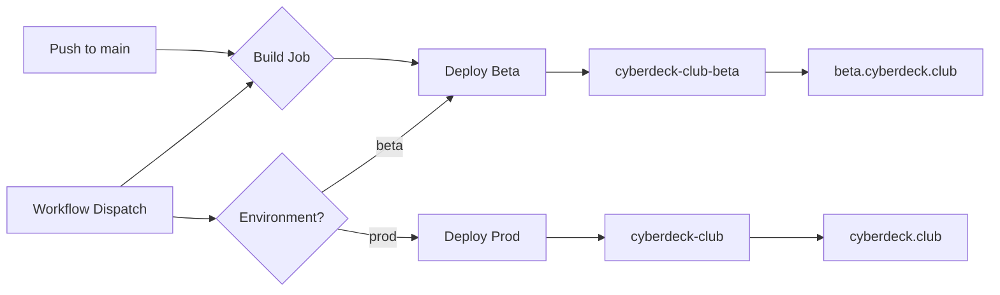

# Deployment Guide

## Overview

cyberdeck.club uses a GitHub Actions workflow for CI/CD deployment to **Cloudflare Workers**. The project uses Astro with the Cloudflare adapter, deploying via `wrangler deploy`.

## Environments

| Environment | Worker Name | URL | Trigger | Wrangler Config |
|-------------|------------|-----|---------|-----------------|
| **Beta** | `cyberdeck-club-beta` | https://beta.cyberdeck.club | Push to `main` | `env.beta` |
| **Production** | `cyberdeck-club` | https://cyberdeck.club | Manual workflow dispatch | Top-level |

### How Workers Environments Work

With Cloudflare Workers, each environment creates a **separate Worker**:

- **Production** (top-level config) — Worker named `cyberdeck-club`, deployed with `wrangler deploy`
- **Beta** (`env.beta` config) — Worker named `cyberdeck-club-beta`, deployed with `wrangler deploy --env beta`

Each Worker has its own:
- D1 database binding (configured in `wrangler.jsonc`)
- Environment variables (configured in `wrangler.jsonc` under `vars`)
- Secrets (configured via `wrangler secret put` or the Cloudflare dashboard)
- Custom domain (configured in the Cloudflare dashboard)

## Deployment Architecture



## Prerequisites

### 1. GitHub Secrets

Configure these secrets in your GitHub repository (**Settings** → **Secrets and variables** → **Actions**):

| Secret | Description | Where to Find |
|--------|-------------|---------------|
| `CLOUDFLARE_API_TOKEN` | API token for Cloudflare Workers | Cloudflare Dashboard → Profile → API Tokens |
| `CLOUDFLARE_ACCOUNT_ID` | Your Cloudflare account ID | Cloudflare Dashboard → Overview (right sidebar) |

#### Creating the Cloudflare API Token

1. Go to [Cloudflare Dashboard](https://dash.cloudflare.com)
2. Navigate to **My Profile** → **API Tokens**
3. Click **Create Token** → Use the **Edit Cloudflare Workers** template
4. Ensure these permissions are included:
   - `Workers Scripts: Edit`
   - `D1: Edit` (for automated migrations)
   - `Account Settings: Read`
5. Set account resources to "Include" your account
6. Copy the generated token and add it to GitHub Secrets

### 2. Worker Secrets

Secrets cannot be stored in `wrangler.jsonc`. Set them for **each Worker** separately:

```bash
# Production Worker (cyberdeck-club)
wrangler secret put BETTER_AUTH_SECRET
wrangler secret put RESEND_API_KEY
wrangler secret put ADMIN_EMAIL

# Beta Worker (cyberdeck-club-beta)
wrangler secret put BETTER_AUTH_SECRET --env beta
wrangler secret put RESEND_API_KEY --env beta
wrangler secret put ADMIN_EMAIL --env beta
```

Or via the dashboard: **Workers & Pages** → click the worker → **Settings** → **Variables & Secrets**.

### 3. Custom Domains

Configure custom domains for each Worker in the Cloudflare dashboard:

| Worker | Custom Domain |
|--------|--------------|
| `cyberdeck-club` | `cyberdeck.club` |
| `cyberdeck-club-beta` | `beta.cyberdeck.club` |

**Navigation:** Workers & Pages → click the worker → **Settings** → **Domains & Routes**

### What's Already in `wrangler.jsonc`

The following are configured in code and don't need dashboard setup:
- `DB` (D1 binding) — `cyberdeck-db` for production, `cyberdeck-db-beta` for beta
- `PUBLIC_BASE_URL` — `https://cyberdeck.club` for production, `https://beta.cyberdeck.club` for beta

## Deployment Methods

### 1. Beta (Auto-deploy)

Beta deployments happen automatically when you push to `main`:

```bash
git checkout main
git merge feature/your-feature
git push origin main
```

The workflow will:
1. Build the project (`astro build`)
2. Checkout `wrangler.jsonc` and `drizzle/migrations/` (sparse checkout)
3. Run D1 migrations against `cyberdeck-db-beta` via `--env beta`
4. Deploy to Worker `cyberdeck-club-beta` via `wrangler deploy --env beta`
5. Make the beta version live at https://beta.cyberdeck.club

### 2. Production (Manual)

To deploy to production:

1. Go to the **Actions** tab in GitHub
2. Select the **Deploy** workflow
3. Click **Run workflow**
4. Select `prod` from the environment dropdown
5. Click **Run workflow**

Or use GitHub CLI:

```bash
gh workflow run deploy.yml --field environment=prod
```

The workflow will:
1. Build the project
2. Run D1 migrations against `cyberdeck-db`
3. Deploy to Worker `cyberdeck-club` via `wrangler deploy`
4. Make the production version live at https://cyberdeck.club

### 3. Local Manual Deploy

```bash
# Deploy to beta
npm run deploy:beta

# Deploy to production
npm run deploy
```

## D1 Database Migrations

Migrations run **automatically** as part of the GitHub Actions deploy workflow. They execute before each deploy step.

### Manual Migration Commands

```bash
# Local development
npm run db:migrate

# Beta (remote)
npm run db:migrate:beta

# Production (remote)
npm run db:migrate:prod
```

Or use wrangler directly:

```bash
# Beta
wrangler d1 migrations apply cyberdeck-db-beta --env beta --remote

# Production
wrangler d1 migrations apply cyberdeck-db --remote
```

## Workflow Details

### Build Step

The workflow always builds first:

```yaml
npm ci
npm run lint  # type check (astro check), continues on error
npm run build  # runs: astro build
```

### Artifact Sharing

Build artifacts (`dist/`) are uploaded and downloaded between jobs to avoid redundant builds. Deploy jobs also do a sparse checkout of `wrangler.jsonc` and `drizzle/migrations/` for D1 migration support.

### Concurrency

The workflow uses concurrency groups to:
- Cancel in-progress runs when a new push occurs
- Prevent overlapping deployments

## Troubleshooting

### Finding environment settings in Cloudflare dashboard

Each Worker is a separate entry in the dashboard:
- **Workers & Pages** → `cyberdeck-club` for production
- **Workers & Pages** → `cyberdeck-club-beta` for beta

Click the worker → **Settings** → **Variables & Secrets** for secrets/env vars, or **Domains & Routes** for custom domains.

### Deployment fails with permission error

Ensure `CLOUDFLARE_API_TOKEN` has permissions for:
- `Workers Scripts: Edit`
- `D1: Edit`
- `Account Settings: Read`

### D1 migrations fail in CI

The deploy jobs do a sparse checkout of the repo to get `wrangler.jsonc` and `drizzle/migrations/`. If migrations fail:
- Check that the migration files exist in `drizzle/migrations/`
- Verify the database IDs in `wrangler.jsonc` match your actual D1 databases
- Ensure `CLOUDFLARE_API_TOKEN` has D1 edit permissions

### Build succeeds but site shows old content

- Check Cloudflare Cache (purge cache in Cloudflare Dashboard)
- Verify the Worker is using the correct custom domain

### Secrets not available at runtime

Secrets must be set for each Worker separately. Use `wrangler secret list` to verify what's set:

```bash
wrangler secret list                # production
wrangler secret list --env beta     # beta
```

### Workflow doesn't trigger

- Ensure Actions are enabled in **Settings** → **Actions**
- Check that the workflow file is at `.github/workflows/deploy.yml`

### "Project not found" error

This means you're using `wrangler pages deploy` instead of `wrangler deploy`. The project is a **Worker**, not a Pages project. Use `wrangler deploy` (or `wrangler deploy --env beta` for beta).
