# Publishing Workflow System — Implementation Plan

**cyberdeck.club** | Status: Draft | Last Updated: 2026-05-01

---

## 1. Current State Analysis

### 1.1 What Exists Today

#### Authentication System
- **Library**: [`better-auth`](src/lib/auth.ts:1) v1.6.5 with magic link plugin
- **User Model**: Defined in [`src/db/auth-schema.ts`](src/db/auth-schema.ts:4) — fields: `id`, `name`, `email`, `emailVerified`, `image`, `role`, `bio`, `createdAt`, `updatedAt`
- **Roles**: `member` (default), `maker` (auto-promoted after first build), `moderator`, `admin`
- **Middleware**: [`src/middleware.ts`](src/middleware.ts:16) resolves session on every request and populates `ctx.locals.user`, `ctx.locals.session`, `ctx.locals.db`
- **Client**: [`src/lib/auth-client.ts`](src/lib/auth-client.ts:14) exposes `authClient` for use in Astro `<script>` blocks

#### Wiki
- **Schema**: [`wikiArticles`](src/db/schema.ts:26), [`wikiCategories`](src/db/schema.ts:17), [`wikiRevisions`](src/db/schema.ts:56)
- **Editor**: [`MarkdownEditor.tsx`](src/components/wiki/MarkdownEditor.tsx:1) wraps `@mdxeditor/editor` with theme detection and custom toolbar (BoldItalicUnderlineToggles, CreateLink, headingsPlugin, listsPlugin, linkPlugin, quotePlugin, thematicBreakPlugin, markdownShortcutPlugin)
- **Inline Editor**: [`InlineEditor.tsx`](src/components/wiki/InlineEditor.tsx:1) wraps MarkdownEditor with save/cancel controls and permission handling
- **Markdown Rendering**: [`MarkdownRenderer.tsx`](src/utils/MarkdownRenderer.tsx:1) uses `marked.parse()` — **no sanitization**
- **Data Access**: [`src/lib/wiki.ts`](src/lib/wiki.ts:1) provides `getWikiArticle()`, `getWikiArticles()`, `getWikiRevisions()`, `searchWikiArticles()`

#### Forum
- **Schema**: [`forumThreads`](src/db/schema.ts:82), [`forumPosts`](src/db/schema.ts:110), [`forumCategories`](src/db/schema.ts:73)
- **Data Access**: [`src/lib/forum.ts`](src/lib/forum.ts:1) provides `getForumThread()`, `getForumThreads()`, `getForumPosts()`, `getForumPostCount()`, `getUserPostCount()`
- **API**: [`POST /api/forum/threads`](src/pages/api/forum/threads.ts:13) creates thread + first post atomically; [`POST /api/forum/posts`](src/pages/api/forum/posts.ts) creates reply posts
- **No comments on threads** — only forum posts (which are thread replies)

#### Builds
- **Schema**: [`builds`](src/db/schema.ts:134) — fields: `id`, `slug`, `title`, `description`, `content`, `heroImageUrl`, `status`, `authorId`, `createdAt`, `updatedAt`
- **Statuses**: `draft`, `published` (inferred from usage in [`src/lib/builds.ts`](src/lib/builds.ts:24))
- **Data Access**: [`getBuilds()`](src/lib/builds.ts:11), [`getBuild()`](src/lib/builds.ts:33), [`getRecentBuilds()`](src/lib/builds.ts:51)
- **API**: [`POST /api/builds`](src/pages/api/builds/index.ts:13) creates a draft build; auto-promotes user from `member` → `maker`
- **No comments on builds** — this is a gap

#### Admin
- **User Management**: [`src/pages/admin/users/index.astro`](src/pages/admin/users/index.astro:1) — list/search/paginate users, change roles (admin only)
- **Admin Roles**: `admin`, `moderator`, `maker`, `member`
- **No dedicated moderator queue** for reported content

#### Markdown
- **Editor**: `@mdxeditor/editor` v3.55.0 already installed
- **Renderer**: `marked` v18.0.2 — **raw HTML output with NO sanitization** — security risk
- **Dependencies present**: `marked`, `@mdxeditor/editor`, `react`

---

## 2. Gap Analysis

### 2.1 Critical Gaps

| Gap | Severity | Impact |
|-----|----------|--------|
| **No XSS sanitization** on markdown render | Critical | User-submitted HTML can execute scripts |
| **No comments on builds** | High | Cannot discuss builds |
| **No comments on wiki pages** | High | Cannot ask questions/clarifications |
| **No community guidelines gate** | High | No "are you human" check before first post |
| **No edit history for forum posts** | Medium | No audit trail for edits |
| **No edit history for builds** | Medium | Cannot revert build changes |
| **No Turnstile/CAPTCHA integration** | High | Spam risk on posting surfaces |
| **MarkdownRenderer has no config** | High | Cannot extend markdown feature set |

### 2.2 Missing Tables

1. **`community_guidelines_acceptances`** — tracks which user accepted which version of guidelines
2. **`build_comments`** — comments on build showcase entries
3. **`wiki_comments`** — comments on wiki articles
4. **`forum_post_revisions`** — edit history for forum posts (optional enhancement)
5. **`build_revisions`** — edit history for builds (optional enhancement)

### 2.3 Missing Pages

1. **`/guidelines`** — community guidelines page (required for the gate)
2. **`/guidelines/accept`** — acceptance action endpoint
3. **Comment UI** for builds and wiki pages

---

## 3. Database Schema Changes

### 3.1 Community Guidelines Acceptance

```typescript
// New table in src/db/schema.ts
export const communityGuidelinesAcceptances = sqliteTable(
  "community_guidelines_acceptances",
  {
    id: text("id").primaryKey(),
    userId: text("user_id")
      .notNull()
      .references(() => user.id, { onDelete: "cascade" }),
    guidelinesVersion: text("guidelines_version").notNull(),
    acceptedAt: integer("accepted_at", { mode: "timestamp_ms" }).notNull(),
    ipAddress: text("ip_address"), // for audit
    userAgent: text("user_agent"), // for audit
  },
  (table) => [
    index("cga_user_id_idx").on(table.userId),
    index("cga_version_idx").on(table.guidelinesVersion),
  ]
);
```

### 3.2 Build Comments

```typescript
// New table in src/db/schema.ts
export const buildComments = sqliteTable(
  "build_comments",
  {
    id: text("id").primaryKey(),
    buildId: text("build_id")
      .notNull()
      .references(() => builds.id, { onDelete: "cascade" }),
    authorId: text("author_id")
      .notNull()
      .references(() => user.id),
    content: text("content").notNull(), // markdown content
    parentId: text("parent_id"), // for threaded replies
    createdAt: integer("created_at", { mode: "timestamp_ms" }).notNull(),
    updatedAt: integer("updated_at", { mode: "timestamp_ms" }).notNull(),
    deletedAt: integer("deleted_at", { mode: "timestamp_ms" }), // soft delete
  },
  (table) => [
    index("build_comments_build_id_idx").on(table.buildId),
    index("build_comments_parent_id_idx").on(table.parentId),
  ]
);
```

### 3.3 Wiki Comments

```typescript
// New table in src/db/schema.ts
export const wikiComments = sqliteTable(
  "wiki_comment",
  {
    id: text("id").primaryKey(),
    articleId: text("article_id")
      .notNull()
      .references(() => wikiArticles.id, { onDelete: "cascade" }),
    authorId: text("author_id")
      .notNull()
      .references(() => user.id),
    content: text("content").notNull(), // markdown content
    parentId: text("parent_id"), // for threaded replies
    createdAt: integer("created_at", { mode: "timestamp_ms" }).notNull(),
    updatedAt: integer("updated_at", { mode: "timestamp_ms" }).notNull(),
    deletedAt: integer("deleted_at", { mode: "timestamp_ms" }), // soft delete
  },
  (table) => [
    index("wiki_comments_article_id_idx").on(table.articleId),
    index("wiki_comments_parent_id_idx").on(table.parentId),
  ]
);
```

### 3.4 Migration Plan

1. Generate migration: `pnpm db:generate`
2. Apply locally: `pnpm db:migrate`
3. Seed initial guidelines version (e.g., `v1.0`)
4. Apply to beta: `pnpm db:migrate:beta`
5. Apply to prod: `pnpm db:migrate:prod`

---

## 4. Community Guidelines Gate

### 4.1 CAPTCHA/Human Verification — Decision: Cloudflare Turnstile

**Recommendation: Cloudflare Turnstile**

| Option | Pros | Cons |
|--------|------|------|
| **Cloudflare Turnstile** | Native to Cloudflare Pages, invisible mode available, no user friction, free | Only works on Cloudflare |
| hCaptcha | Privacy-focused, well-supported | Requires external account, adds user friction |
| Google reCAPTCHA | Familiar | Poor UX, privacy concerns, not cloudflare-native |

**Rationale**: Since this app deploys on Cloudflare Pages + Workers, Turnstile integrates naturally. Use **invisible mode** for returning users and **managed mode** for first-time posters to balance spam protection with UX.

### 4.2 Guidelines Gate Architecture

```
┌─────────────────┐     ┌──────────────────┐     ┌─────────────────┐
│ User attempts   │────▶│ POST /api/        │────▶│ Check if        │
│ any publish     │     │ guidelines/accept │     │ accepted +      │
│ action          │     │ (with Turnstile   │     │ version current │
└─────────────────┘     │ token)            │     └─────────────────┘
                        └──────────────────┘               │
                               │                            │
                               ▼                            ▼
                        ┌──────────────────┐     ┌─────────────────┐
                        │ Render           │     │ Render actual   │
                        │ /guidelines      │     │ publishing      │
                        │ page with        │     │ surface         │
                        │ acceptance form  │     │ (thread editor, │
                        │ (if not accepted)│     │ build form,     │
                        └──────────────────┘     │ comment form)   │
                                                 └─────────────────┘
```

### 4.3 Gate Check Flow

All publishing API routes (`POST /api/forum/threads`, `POST /api/forum/posts`, `POST /api/builds`, `POST /api/builds/[id]/comments`, `POST /api/wiki/articles`, `POST /api/wiki/comments`) MUST check:

```typescript
// Pseudocode — add to each publishing API route
async function hasAcceptedGuidelines(userId: string, db: Database): Promise<boolean> {
  const latestVersion = await getLatestGuidelinesVersion(); // static config
  const acceptance = await db.query.communityGuidelinesAcceptances.findFirst({
    where: and(
      eq(communityGuidelinesAcceptances.userId, userId),
      eq(communityGuidelinesAcceptances.guidelinesVersion, latestVersion)
    ),
  });
  return !!acceptance;
}
```

### 4.4 Where to Store Acceptance State

- **`community_guidelines_acceptances` table** — per-user, per-version acceptance
- **Version string** stored as a constant in `src/lib/guidelines.ts` (e.g., `"v1.0"`)
- When guidelines change, increment version — all users must re-accept

### 4.5 Pages to Create

| File | Purpose |
|------|---------|
| `src/pages/guidelines.astro` | Render guidelines content, show acceptance button |
| `src/pages/api/guidelines/accept.ts` | Handle acceptance with Turnstile verification |
| `src/pages/api/guidelines/status.ts` | Check if current user has accepted current version |

### 4.6 Turnstile Integration

```typescript
// In src/pages/api/guidelines/accept.ts
const formData = await ctx.request.formData();
const turnstileToken = formData.get("cf-turnstile-response");
const ip = ctx.request.headers.get("CF-Connecting-IP"); // Cloudflare provided

// Verify with Cloudflare
const verifyResponse = await fetch(
  "https://challenges.cloudflare.com/turnstile/v0/siteverify",
  {
    method: "POST",
    headers: { "Content-Type": "application/x-www-form-urlencoded" },
    body: new URLSearchParams({
      secret: cfEnv.TURNSTILE_SECRET_KEY,
      response: turnstileToken,
      remoteip: ip,
    }),
  }
);
```

Add to `wrangler.jsonc`:
```jsonc
{
  "vars": {
    "TURNSTILE_SITE_KEY": "...",
    "TURNSTILE_SECRET_KEY": "..."
  }
}
```

---

## 5. Shared Markdown Editor Architecture

### 5.1 Evaluation of Existing [`MarkdownEditor.tsx`](src/components/wiki/MarkdownEditor.tsx:1)

**What it does today:**
- Wraps `@mdxeditor/editor` with CodeMirror 6 foundation
- Theme detection via `MutationObserver` on `<html class>`
- Custom CSS styling using CSS variables
- Toolbar: BoldItalicUnderlineToggles, CreateLink
- Plugins: headings, lists, link, quote, thematicBreak, markdownShortcut

**What it lacks:**
- No image upload handling (would need for builds/wiki inline images)
- No code block syntax highlighting (though CodeMirror supports it)
- Single-column toolbar (could be expanded)
- No `placeholder` in markdown mode (the editor has it, just not exposed in toolbar)

**Verdict**: The existing component is a solid foundation. It can be generalized to a shared `SharedMarkdownEditor` component.

### 5.2 Shared Editor Props Interface

```typescript
// src/components/editor/SharedMarkdownEditor.tsx

export interface SharedMarkdownEditorProps {
  /** Current markdown content */
  value: string;
  /** Called when content changes */
  onChange: (value: string) => void;
  /** Placeholder text when empty */
  placeholder?: string;
  /** Minimum height of the editor */
  minHeight?: string;
  /** Additional CSS classes */
  className?: string;
  /** Toolbar configuration */
  toolbar?: EditorToolbarConfig;
  /** Whether the editor is read-only */
  disabled?: boolean;
  /** Available markdown features for this surface */
  features?: EditorFeatures;
}

export interface EditorToolbarConfig {
  /** Show bold/italic/underline toggles */
  boldItalic?: boolean;       // default: true
  /** Show link creation */
  links?: boolean;            // default: true
  /** Show heading toggles */
  headings?: boolean;         // default: true
  /** Show list toggles */
  lists?: boolean;            // default: true
  /** Show quote block */
  quotes?: boolean;           // default: true
  /** Show thematic break / HR */
  thematicBreak?: boolean;    // default: true
  /** Show code block */
  codeBlock?: boolean;        // default: false (for anti-spam)
  /** Show image upload */
  imageUpload?: boolean;      // default: false
  /** Show table support */
  tables?: boolean;           // default: false
}

export interface EditorFeatures {
  /** Surface type for feature gating */
  surface: "forum-thread" | "forum-reply" | "build-comment" | "build-content" | "wiki-content" | "wiki-comment";
}
```

### 5.3 Surface-Specific Configurations

| Surface | Toolbar | Features |
|---------|---------|----------|
| `forum-thread` | boldItalic, links, headings, lists, quotes | link-only, no image |
| `forum-reply` | boldItalic, links, lists, quotes | link-only, no image |
| `build-comment` | boldItalic, links, lists | link-only, no image |
| `build-content` | boldItalic, links, headings, lists, quotes, codeBlock, imageUpload | full features |
| `wiki-content` | boldItalic, links, headings, lists, quotes, codeBlock, imageUpload, tables | full features |
| `wiki-comment` | boldItalic, links, lists | link-only, no image |

### 5.4 File Location

```
src/components/
  editor/
    SharedMarkdownEditor.tsx    # Core editor component (generalized from wiki/MarkdownEditor)
    EditorToolbar.tsx           # Toolbar button components
    ImageUploadButton.tsx       # Optional image upload (future)
    useEditorTheme.ts           # Theme detection hook (from existing wiki/MarkdownEditor)
```

**Refactor path**: Rename `src/components/wiki/MarkdownEditor.tsx` to `src/components/editor/SharedMarkdownEditor.tsx` after generalizing. Keep `InlineEditor.tsx` in wiki namespace since it's wiki-specific (save/cancel navigation to wiki URLs).

### 5.5 React Island Configuration

```astro
<!-- In any Astro page -->
<SharedMarkdownEditor
  client:visible
  value={initialContent}
  onChange={handleChange}
  features={{ surface: "forum-thread" }}
  toolbar={{ boldItalic: true, links: true, headings: true, lists: true, quotes: true }}
  minHeight="200px"
/>
```

**Note**: Use `client:visible` for below-fold editors, `client:load` for above-fold editors. All prop values must be JSON-serializable (no functions passed as props).

---

## 6. Markdown Rendering Pipeline

### 6.1 Current State

The [`MarkdownRenderer.tsx`](src/utils/MarkdownRenderer.tsx:1) uses raw `marked.parse()` with no sanitization:

```tsx
// CURRENT (INSECURE)
const html = marked.parse(content) as string;
return <div dangerouslySetInnerHTML={{ __html: html }} />;
```

### 6.2 Security Requirements

1. **Sanitize all HTML** — strip `<script>`, `<iframe>`, `onclick`, `onerror`, `javascript:` URLs, etc.
2. **Allow safe markdown constructs** — headings, bold, italic, links (with `rel="noopener noreferrer"`), lists, blockquotes, code blocks, images
3. **Image proxying** (optional enhancement) — prevents tracking pixels in user-submitted images

### 6.3 Recommended Packages

| Package | Purpose | Justification |
|---------|---------|--------------|
| `dompurify` | HTML sanitization | Standard for XSS prevention; works in Cloudflare Workers |
| `isomorphic-dompurify` | Same, isomorphic wrapper | Works in both Node.js and edge runtimes |

### 6.4 Updated Renderer Design

```typescript
// src/utils/MarkdownRenderer.tsx (updated)
import { marked } from "marked";
import DOMPurify from "isomorphic-dompurify";

// Configure marked for safe rendering
const markedInstance = marked.setOptions({
  breaks: true,       // Convert \n to <br>
  gfm: true,          // GitHub Flavored Markdown
});

// Sanitization config
const SANITIZE_CONFIG = {
  ALLOWED_TAGS: [
    "h1", "h2", "h3", "h4", "h5", "h6",
    "p", "br", "hr",
    "strong", "em", "del", "s", "mark",
    "ul", "ol", "li",
    "blockquote",
    "pre", "code",
    "a",
    "img",
    "table", "thead", "tbody", "tr", "th", "td",
    "div", "span",
  ],
  ALLOWED_ATTR: ["href", "src", "alt", "title", "class", "id"],
  FORBID_TAGS: ["script", "style", "iframe", "form", "input", "object", "embed"],
  FORBID_ATTR: ["onerror", "onclick", "onload", "onmouseover"],
  ADD_ATTR: ["rel"],
  ALLOW_DATA_ATTR: false,
};

export function renderMarkdown(content: string): string {
  const rawHtml = markedInstance.parse(content) as string;
  // Add rel to all links
  const withRel = rawHtml.replace(/<a /g, '<a rel="noopener noreferrer" ');
  return DOMPurify.sanitize(withRel, SANITIZE_CONFIG);
}

export const MarkdownRenderer = ({ content, className = "" }: MarkdownRendererProps) => {
  const html = renderMarkdown(content);
  return <div className={className} dangerouslySetInnerHTML={{ __html: html }} />;
};
```

### 6.5 Additional Security: Link Validation

For user-submitted links, validate against a URL allowlist or block `javascript:` protocol:

```typescript
// In SANITIZE_CONFIG.ALLOWED_ATTR, add a custom hook
ADD_ATTR: ["rel"],
// After sanitize, strip javascript: hrefs
const stripJavascript = (html: string) =>
  html.replace(/href="javascript:[^"]*"/gi, 'href="#"');
```

### 6.6 File Changes

| File | Change |
|------|--------|
| `src/utils/MarkdownRenderer.tsx` | Replace raw `marked.parse()` with sanitized version |
| `package.json` | Add `isomorphic-dompurify` |

---

## 7. Publishing Surfaces & Access Control Matrix

### 7.1 Forum

| Action | Who Can Do It | Notes |
|--------|---------------|-------|
| **View forum** | Everyone (public) | No auth required |
| **View thread** | Everyone (public) | No auth required |
| **Create new thread** | Authenticated user who has accepted guidelines | First post triggers maker promotion (already exists) |
| **Reply to thread** | Authenticated user who has accepted guidelines | — |
| **Edit own post** | Post author | `updatedAt` updated, soft-edit indicator shown |
| **Edit others' posts** | `moderator`, `admin` only | Audit log entry created |
| **Delete own post** | Post author | Soft delete (`deletedAt` set) |
| **Delete others' posts** | `moderator`, `admin` only | Soft delete |
| **Pin thread** | `moderator`, `admin` only | Admin API already exists |
| **Lock thread** | `moderator`, `admin` only | Admin API already exists |

**Edit time limit**: Posts older than 30 minutes cannot be edited by author (only mods/admins).

### 7.2 Builds

| Action | Who Can Do It | Notes |
|--------|---------------|-------|
| **View builds** | Everyone (public) | Only `status: published` |
| **Submit build** | Authenticated user who has accepted guidelines | Creates as `draft`, auto-promotes to `maker` |
| **Publish build** | Build author | Transitions `draft` → `published` |
| **Edit own build** | Build author | Anyone with `maker` or higher role |
| **Edit others' builds** | `moderator`, `admin` only | Audit log entry |
| **Delete own build** | Build author | Soft delete recommended |
| **Delete others' builds** | `admin` only | Hard delete |
| **Comment on build** | Authenticated user who has accepted guidelines | New `buildComments` table |
| **Edit own comment** | Comment author (within 30 min) | — |
| **Delete own comment** | Comment author | Soft delete |
| **Delete others' comments** | `moderator`, `admin` only | Soft delete |

### 7.3 Wiki

| Action | Who Can Do It | Notes |
|--------|---------------|-------|
| **View wiki** | Everyone (public) | Only `status: published` |
| **Create wiki page** | `maker`, `moderator`, `admin` roles | NOT plain `member` |
| **Edit own wiki page** | Page author OR anyone with `maker`+ role | Creates revision entry |
| **Edit others' wiki pages** | `maker`, `moderator`, `admin` | Revision created |
| **Delete wiki page** | `moderator`, `admin` | Soft delete recommended |
| **Comment on wiki page** | Authenticated user who has accepted guidelines | New `wikiComments` table |
| **Edit own comment** | Comment author (within 30 min) | — |
| **Delete own comment** | Comment author | Soft delete |
| **Delete others' comments** | `moderator`, `admin` only | Soft delete |

**Note**: Wiki pages require `maker` role to create/edit because wiki content is expected to be substantive, curated knowledge. This is distinct from forum posts which are conversational.

### 7.4 Cross-Cutting Rules

| Capability | `member` | `maker` | `moderator` | `admin` |
|------------|----------|---------|-------------|---------|
| Post forum thread | ✅ (if guidelines accepted) | ✅ | ✅ | ✅ |
| Post forum reply | ✅ (if guidelines accepted) | ✅ | ✅ | ✅ |
| Create build | ❌ | ✅ | ✅ | ✅ |
| Publish build | ❌ | Author only | ✅ | ✅ |
| Edit own build | ❌ | ✅ | ✅ | ✅ |
| Create wiki page | ❌ | ✅ | ✅ | ✅ |
| Edit any wiki page | ❌ | ✅ | ✅ | ✅ |
| Post build comment | ✅ (if guidelines accepted) | ✅ | ✅ | ✅ |
| Post wiki comment | ✅ (if guidelines accepted) | ✅ | ✅ | ✅ |
| Edit others' posts | ❌ | ❌ | ✅ | ✅ |
| Delete any content | ❌ | ❌ | ✅ (soft) | ✅ (hard) |
| Manage users | ❌ | ❌ | ❌ | ✅ |

---

## 8. Implementation Order

### Phase 1: Foundation (Do First)
These are dependencies for everything else.

1. **Add `isomorphic-dompurify` to package.json**
   - Required before any user-submitted markdown can be rendered safely

2. **Update `MarkdownRenderer.tsx` with sanitization**
   - Replace raw `marked.parse()` with DOMPurify sanitized version
   - Apply to all surfaces retroactively once updated

3. **Add database tables for comments** (`build_comments`, `wiki_comments`)
   - Generate migration: `pnpm db:generate`
   - Apply: `pnpm db:migrate`

4. **Add `community_guidelines_acceptances` table**
   - Generate migration: `pnpm db:generate`
   - Apply: `pnpm db:migrate`

### Phase 2: Community Guidelines Gate
Requires Phase 1 table to exist.

5. **Create `/guidelines` page** (`src/pages/guidelines.astro`)
   - Static content page with guidelines text
   - Acceptance button/form

6. **Create `POST /api/guidelines/accept` endpoint**
   - Verify Turnstile token
   - Record acceptance in DB

7. **Create `GET /api/guidelines/status` endpoint**
   - Check if user has accepted current version

8. **Add gate check to all publishing API routes**
   - Forum threads, forum posts, build creation, wiki articles
   - Return `403` with redirect hint if guidelines not accepted

### Phase 3: Shared Editor
Generalizes the wiki editor for reuse.

9. **Refactor `MarkdownEditor.tsx` → `SharedMarkdownEditor.tsx`**
   - Add surface-specific toolbar configs
   - Add `features` prop for feature gating
   - Keep in `src/components/editor/`

10. **Update wiki pages** to use new `SharedMarkdownEditor`
    - `src/pages/wiki/[category]/[slug].astro` — inline editor
    - Create article modal

11. **Update forum pages** to use `SharedMarkdownEditor`
    - New thread form
    - Reply form

### Phase 4: Comments System
Requires Phase 1 (tables) and Phase 3 (editor).

12. **Create comment API endpoints**
    - `POST /api/builds/[id]/comments` — add comment to build
    - `DELETE /api/builds/comments/[id]` — soft delete
    - `POST /api/wiki/comments` — add comment to wiki article
    - `DELETE /api/wiki/comments/[id]` — soft delete

13. **Add comment UI to build detail page** (`src/pages/builds/[slug].astro`)
    - List existing comments (rendered via `MarkdownRenderer`)
    - Comment form with `SharedMarkdownEditor`

14. **Add comment UI to wiki article page** (`src/pages/wiki/[category]/[slug].astro`)
    - Same pattern as build comments

15. **Add `useGuidelinesAccepted()` helper** to lib
    - Reusable check for the gate on client side

### Phase 5: Polish & Hardening

16. **Add edit time limit** (30 min) for own content
    - Update forum post API
    - Update build comment API
    - Update wiki comment API

17. **Add soft delete support** to all comment queries
    - Filter `deletedAt IS NULL` in lib functions

18. **Add moderation indicators**
    - "Edited by moderator" badge
    - "This content has been removed" placeholder for soft-deleted

---

## 9. File-by-File Implementation Plan

### New Files to Create

| File | Purpose |
|------|---------|
| `src/pages/guidelines.astro` | Community guidelines page |
| `src/pages/api/guidelines/accept.ts` | Guidelines acceptance API |
| `src/pages/api/guidelines/status.ts` | Check acceptance status API |
| `src/pages/api/builds/[id]/comments.ts` | Build comments API |
| `src/pages/api/wiki/comments.ts` | Wiki comments API |
| `src/components/editor/SharedMarkdownEditor.tsx` | Generalized MDX editor |
| `src/components/editor/EditorToolbar.tsx` | Toolbar components |
| `src/components/editor/useEditorTheme.ts` | Theme detection hook |
| `src/components/comments/BuildCommentList.tsx` | Build comments list + form |
| `src/components/comments/WikiCommentList.tsx` | Wiki comments list + form |
| `src/lib/guidelines.ts` | Guidelines version + check utilities |
| `src/lib/comments.ts` | Comment data access functions |

### Files to Modify

| File | Changes |
|------|---------|
| `src/db/schema.ts` | Add 3 new tables |
| `src/db/auth-schema.ts` | No changes needed |
| `src/utils/MarkdownRenderer.tsx` | Add DOMPurify sanitization |
| `src/middleware.ts` | Optionally add guidelines check to `ctx.locals` |
| `src/pages/api/forum/threads.ts` | Add guidelines gate check |
| `src/pages/api/forum/posts.ts` | Add guidelines gate check |
| `src/pages/api/builds/index.ts` | Add guidelines gate check |
| `src/pages/api/wiki/articles.ts` | Add guidelines gate check (for wiki create) |
| `src/pages/builds/[slug].astro` | Add comments section |
| `src/pages/wiki/[category]/[slug].astro` | Add comments section |
| `src/components/wiki/MarkdownEditor.tsx` | Deprecate in favor of shared editor |
| `src/lib/forum.ts` | Add `hasAcceptedGuidelines` check |
| `src/lib/builds.ts` | Add comment query functions |
| `src/lib/wiki.ts` | Add comment query functions |
| `package.json` | Add `isomorphic-dompurify` |
| `wrangler.jsonc` | Add Turnstile env vars |
| `DESIGN.md` | Document new components |

---

## 10. Package Additions

```json
{
  "dependencies": {
    "isomorphic-dompurify": "^2.14.0"
  }
}
```

**Note**: `isomorphic-dompurify` works in Cloudflare Workers environment. Do NOT use `dompurify` directly as it requires browser APIs.

---

## 11. Mermaid: Publishing Flow with Guidelines Gate

```mermaid
sequenceDiagram
    participant U as User
    participant FE as Frontend
    participant API as API Route
    participant DB as D1 Database
    participant CF as Cloudflare Turnstile

    U->>FE: Clicks "New Thread"
    FE->>API: POST /api/forum/threads
    API->>DB: Check guidelines acceptance
    DB-->>API: No acceptance record
    API-->>FE: 403 { error: "guidelines_required", redirect: "/guidelines" }
    FE->>U: Redirect to /guidelines

    U->>FE: Reads guidelines, clicks "I Accept"
    FE->>CF: Verify Turnstile token (invisible)
    CF-->>FE: Token valid
    FE->>API: POST /api/guidelines/accept
    API->>DB: Insert acceptance record
    DB-->>API: Success
    API-->>FE: 200 { accepted: true }
    FE->>U: Redirect back to forum

    U->>FE: Creates thread
    FE->>API: POST /api/forum/threads
    API->>DB: Check acceptance
    DB-->>API: Has acceptance
    API->>DB: Create thread + first post
    DB-->>API: Success
    API-->>FE: 201 { threadId, slug }
    FE->>U: Thread created
```



---

## 12. Key Design Decisions Summary

| Decision | Rationale |
|----------|-----------|
| **Cloudflare Turnstile** over hCaptcha/reCAPTCHA | Native to Cloudflare Pages deployment; invisible mode reduces friction |
| **Guidelines acceptance stored per-version** | Allows re-gating when guidelines change significantly |
| **SharedMarkdownEditor with surface config** | DRY; enforces feature restrictions per surface (no image embeds in comments) |
| **DOMPurify sanitization in MarkdownRenderer** | XSS prevention; works in Workers environment |
| **Soft delete for comments and posts** | Moderation reversibility; audit trail preserved |
| **Maker role for wiki create/edit** | Wiki is curated knowledge; not every authenticated user should create wiki pages |
| **30-minute edit window for own content** | Prevents abuse while allowing typo fixes |
| **`client:visible` for editor islands** | Performance: only load editor when scrolled into view |
